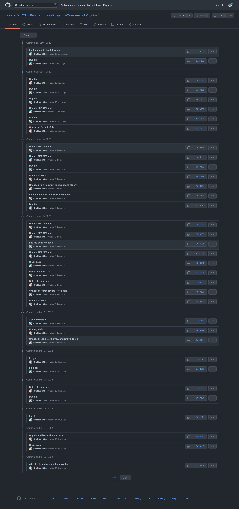
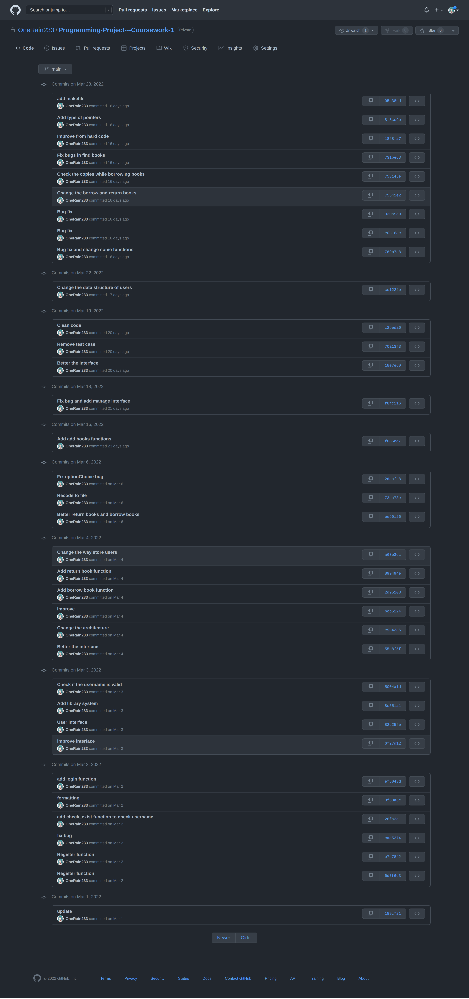

# XJCO 1921- Programming Project - Coursework 1

## Git Repository

[Github](https://github.com/OneRain233/Leeds_ProgramingProject1)

## Usage

```
❯ make all
Building library
Compiling
gcc -Wall main.c login.c register.c user.c utils.c interface.c admin.c book_management.c -o library
Done
❯ ./library
Usage: ./library <book_file> <user_file>
❯ touch books.txt
❯ touch users.txt
❯ ./library books.txt users.txt
```

## Commit Screenshot




